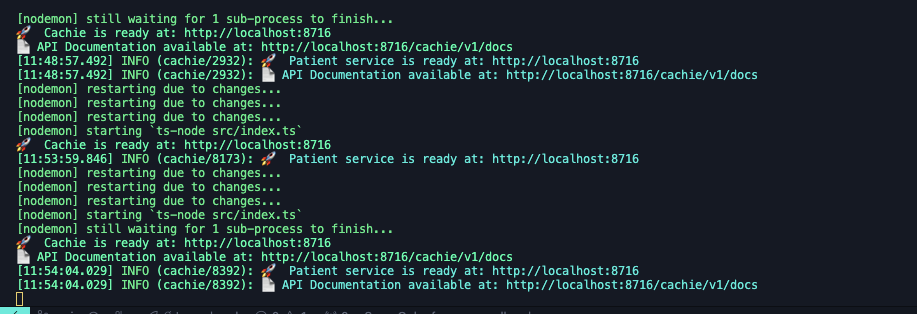

# Cachie

Cachie is an analytics engine that tracks search patterns with support for pattern matching, statistical analysis, and client tracking.

## Features
- Completely written in [Typescript](https://typescriptlang.org/)
- [Express](https://expressjs.com/) Nodejs framework
- [Jest](https://jestjs.io) and [Supertest](https://www.npmjs.com/package/supertest) for automated test
- [Pino](https://getpino.io/) for logging
- [Axiom](https://axiom.co/) Transporter for Pino (you can remove if you don't need it and don't forget to update your pino config if you remove this)

## Project File Structure
- `src` - All source code
  - `__tests__` - Unit test files
  - `api-v1` - Open API documentation for API endpoints.
  - `controllers` - Controllers responsible for handling requests and business logic (Use Cases)
  - `image` - Screenshot showing when the server start successfully
  - `interface` - Interface and types
  - `routes` - API endpoints (Interface Adapters)
  - `services` - Services for interacting with other services or third-party APIs
  - `utils` - Utility functions (helper and library functions)
  - `app.ts` - Main application file (Framework and Drivers)
  - `index.ts` - Server file (entry point)

## How to install from source
- Clone the repository - `git clone repo-link`
- `cd project-folder`
- Install dependencies - `yarn install`
- Setup environment variable - `cp .env.example .env`
- Run development server `yarn dev`
- Run test suite `yarn test`
- Run production server `yarn start`

You will get this result when the server start successfully

